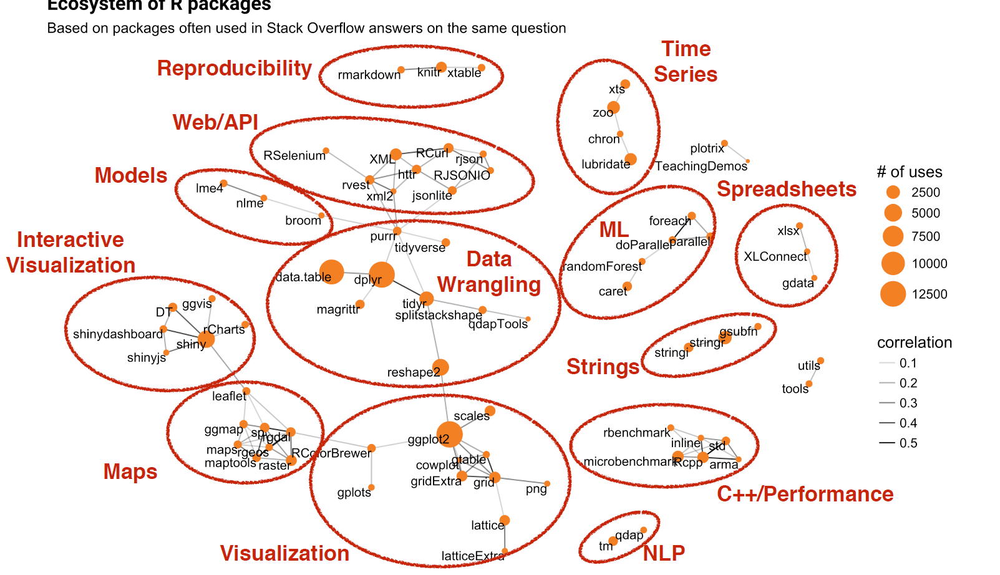

# A Map of the R world
#### A Pythonist's Journey to the R World

This project analyzes and visualizes the R programming language ecosystem, with the goal of 1) helping analysts find tools most suitable for their goals, and 2) helping developers write interoperable codes and fill the gaps in the ecosystem.

As a person who code mostly in Python, picking up R is a bit of struggle at first. The immediate challange is  syntactical:  `<-` v.s. `=` are both assignment but different, `data.table` is a legit package name not class method ... But what surprised me the most is that there often exist multiple libraries and functions for the same task. For example, `dplyr`,`data.table`,`tibble` are all popular libraries for processing tabular data in R. From where I came from, `pandas` is the go-to choice for tabular data wrangling. The less well-known alternatives (`Dask`,` Modin`,` Vaex`) all follow the same design as `pandas`, changing only their underlying implementation. The fact that there are multiple ways to do the same thing means that one can easily get lost in the R world during first visit. Since there are so many places to look, I thought, 

> Maybe I can plot a map of the R world for newcomers like me?

This is the basic idea behind this project, map and visualize R packages based on semantic information and calculate metrics to help people find the "right" toolset. 

#### Project Structure and Roadmap

My plan is to break down the project into two stages. Stage I focus on creating some proof-of-concept visualizations, verifying whether semantic clustering is feasible and testing what strategies are effective for visual exploration. Stage II will calculate additional metrics and fine-tune clustering results, as well as build an interactive website with recommendation feature. 

Stage I have four steps: Collection, Modeling, Visualization. 

##### Collection

There are multiple sources that host information about R packages. I initially tried to pull data from the [CRAN](https://cran.r-project.org) website, since it has a clean webpage structure and contain links to full package documentation. But I soon realized two problems: 1) CRAN website doesn't include popularity indicator like number of downloads or github star count 2) Package documentations are in PDF format, which are very hard to parse and clean in batch (this could become a project of its own). 

After banging my head for two days, I suddenly realized that I can get the data more efficiently from third-party search platform for R. I often use [Rdocumentation](https://rdocumentation.org) and [rdrr.io](https://rdrr.io) to learn about new pacakge, and I chose the former because 1) its has rich popularity metrics and metadada, 2) it covers [CRAN](https://cran.r-project.org) and [Bioconducter](http://bioconductor.org/), two main R package archives, 3) it uses MIT license. Moreover, Rdocumentation show documentation of functions on page (which are fascinating materials for analyzing syntactic style and functionality design). 

There are many interesting challenges with data cleaning and feature engineering based on metrics and metadata, but I would like to skip them for now and focus on the visualization POC. 

##### Modeling

To reveal patterns in large ecosystem, clustering is an intuitive method. Since the goal is to show which packages are for what tasks, titles and descriptions are the best information to work with. Here, we need to use some Natural Language Processing (NLP) techniques to make textual information amenable to clustering method. 

If you are not interested in the NLP part, please feel free to jump to the Visualization section. There, I will explain the intuition of this part and n

Topic modeling methods like LDA, PLSA are the most common techniques for clustering texts. Here, I choose to go with word-embedding-based clustering mainly because the by-product, embedding vector of the packages, can be used as coordinates in subsequent plotting step. In comparison, the outputs of word-type-based clustering do not enjoy semantic similarity between representation of similar words). 

To do clustering with word-embedding, I first need to decide whether I want to use pre-trained word-embedding or train embedding for this specific corpus of R package descriptions. My expectation is that 

Wordclouds

##### Visualization

The most common way to display clustering results is through a scatter plot. 

Interpretability of dimensions. 

Dimensionality reduction. 

Overplotting.

Adding color (second variable).

Adding size (third variable).

Redefining popularity.

Adding ring (fourth variable).

Going 3D.

Navigation Camera.

Tooltip for more information.

Image source: [Word Embedding: Basics](https://medium.com/@hari4om/word-embedding-d816f643140) by [Hariom Gautam](https://medium.com/@hari4om)  

#### Where to go from here? 

Screenshot from Talk [We R What We Ask: The Landscape of R Users on Stack Overflow](https://channel9.msdn.com/Events/useR-international-R-User-conferences/useR-International-R-User-2017-Conference/We-R-What-We-Ask-The-Landscape-of-R-Users-on-Stack-Overflow) by [David Robinson](https://channel9.msdn.com/Events/Speakers/david-robinson) at useR! Conference July 2017

[METACRAN](https://www.r-pkg.org) Project

MetaCran does semantic search well, metrics calculation making sense

Stage II focus on personalized experience, syntactic style, research circles, associative filtering recommendation, mining common combos, discover niche/boutique packages.