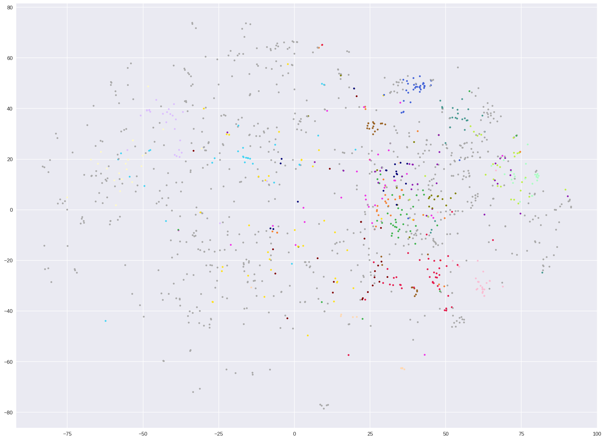
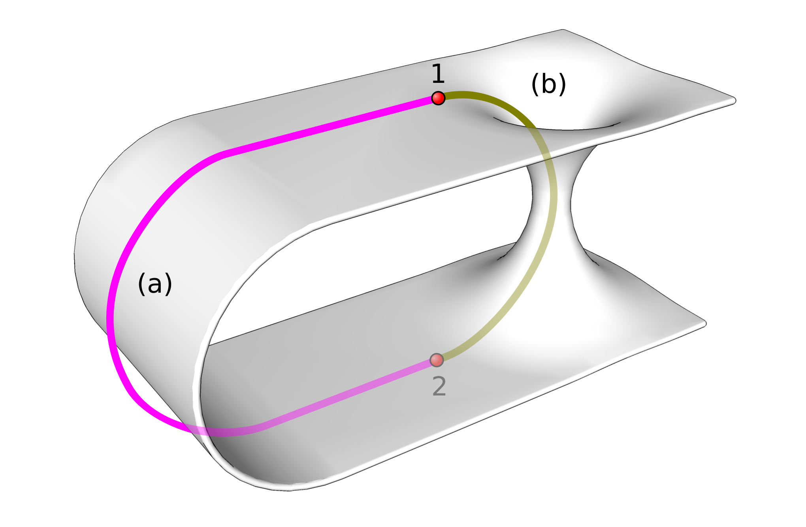
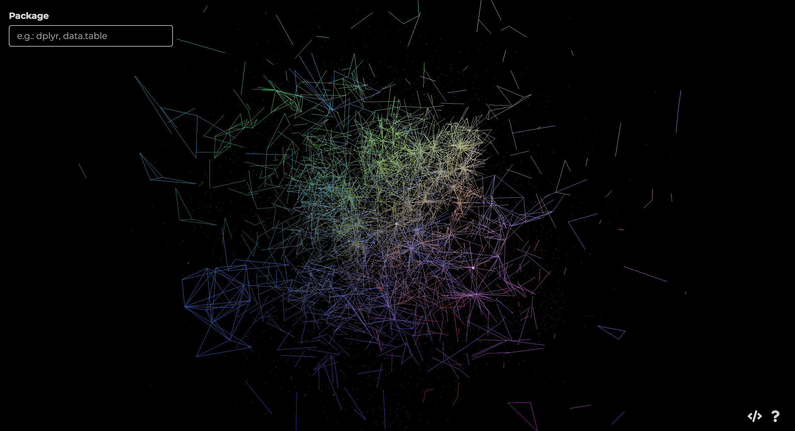

# Map of the R world
### A Pythonist's jouRney

This project analyzes and visualizes the R package ecosystem to help people find the most suitable tool for their tasks.

As a person who code mostly in Python, picking up R is a bit of struggle at first. The immediate challange is  syntactical:  `<-` v.s. `=` are both assignment but different, `data.table` is a legit package name not class method ... But what surprised me the most is that there often exist **multiple libraries and functions for the same task**. For example, `dplyr`,`data.table`,`tibble` are all popular libraries for processing tabular data in R. From where I came from, `pandas` is the go-to choice for tabular data wrangling. The less well-known alternatives (`Dask`,` Modin`,` Vaex`) all follow the same design as `pandas`, changing only their underlying implementation. The **flexibility is a gift** from the open-source community, **but one can also easily get lost in the R world** during first visit. So I thought, 

> **Maybe I can plot a map of the R world for newcomers like me?**

This is the basic idea behind this project, map and visualize R packages based on semantic information and calculate metrics to help you find the "right" toolset. 

## Project Structure and Roadmap

My plan is to break down the project into two stages. **Stage I** focus on creating some **proof-of-concept visualizations**, verifying whether semantic clustering is feasible and testing what strategies are effective for visual exploration. **Stage II** will calculate additional metrics and fine-tune clustering results, as well as build an **interactive package recommender**.

Stage I have three steps: Collection, Modeling, Visualization. 

### Collection

There are multiple sources that host information about R packages. I initially tried to pull data from the [CRAN](https://cran.r-project.org) website, since it has a clean webpage structure and contain links to full package documentation. But I soon realized two problems: 1) CRAN website doesn't include popularity indicator like number of downloads or github star count 2) Package documentations are in PDF format, which are very hard to parse and clean in batch (this could become a project of its own). 

After banging my head about data extraction for two days, I suddenly realized that I can get the data more efficiently from third-party search platform for R. I often use [Rdocumentation](https://rdocumentation.org) and [rdrr.io](https://rdrr.io) to learn about new pacakge, and I chose the former because 1) its has rich **popularity metrics and metadada**, 2) it covers [CRAN](https://cran.r-project.org) and [Bioconducter](http://bioconductor.org/), two main R package archives, 3) it uses MIT license. Moreover, Rdocumentation show documentation of functions on page (which are fascinating materials for analyzing syntactic style and functionality design). 

There are many interesting challenges with data cleaning and feature engineering based on metrics and metadata, but I would like to skip them for now and focus on the visualization POC. 

### Modeling

To reveal patterns in large ecosystem, clustering is an intuitive method. Since the goal is to show which packages are for what tasks, titles and descriptions are the best information to work with. Here, we need to use some Natural Language Processing (NLP) techniques to make textual information amenable to clustering method. 

> If you are not interested in the NLP details, please feel free to jump to the Visualization section. I will explain the general intuition about modeling there.

Topic modeling methods like LDA, PLSA are the most common techniques for clustering texts. Here, I choose to go with word-embedding-based clustering mainly because the by-product, **package embedding vector, can be used as coordinates in subsequent plotting step**. In comparison, the outputs of word-type-based clustering do not enjoy semantic similarity between representation of similar words. 

There were two technical decisions to make. One, to use **pre-trained embedding or train new embedding** of R package descriptions. I experimented with both approaches and found out pre-trained embedding produce results that are too generic, thus not useful for guiding package selection. For traing embedding, I used the FastText model distributed by Gensim libraries. Second decision is which clustering algorithm to use. **Kmeans and DBSCAN** are the candidates I considered. I chose to go with Kmeans for its speed, and also tuning number of clusters (kmeans parameter) is more intuitive than tuning radius of clusters (DBSCAN parameter),  especially in a high-dimensional space.

At the end of this step, my clustering model assign packages to 100 clusters. The bar chart below shows how many packages are in each cluster. 

Among these clusters, I chose thirteen **largest clusters**, assigning each of them a random, distinct color so that I can mark them in the R landscape. To identify the theme of each package cluster, I created a series of wordclouds (in different shades of the corresponding cluster color) and printed out the most downloaded packages within each cluster. 

By observing the words and checking the top packages, I managed to **summarize the cluster themes** (and discovered many new R packages along the way). I can feel that the semantic clustering idea is working, but the model still has a lot of room for improvement. The choice of model parameter, initialization conditions, preprocessing techniques are all fascinating aspects that I only had a limited chance to tune. But let's move on to visualization for now.

### Visualization

Now that we have the clustering results, it's time to visualize it! You may ask, **why don't we simply make one list for each cluster and format them as a table**? Well, it is a straightforward idea, but many packages are not for a single purpose. By forcing a package into one position in the table, we lose sight of **versatility of the packages** and **its place in the larger ecosystem**.

Fortunately, we have access to the package embedding vectors, which act as the coordinates of a package in the semantic space. What do I mean by that? 

*Image source: [Word Embedding: Basics](https://medium.com/@hari4om/word-embedding-d816f643140) by [Hariom Gautam](https://medium.com/@hari4om)*  

The intuition behind word embedding is that we can describe a word with its scores on different metrics. If you look at the first column in the table above, all words except for "houses" has a positive score for "living being". If you focus on the third column, pets are clearly not as "human" as the words describing different groups in humans. Among the words describing humans, words refering to males and females have bipolar values on "gender". The assumption here is, if we have **enough dimensions/metrics** to evaluate the words against, and we **assign the scores in a smart way**,  we can **represent the words with** its scores for different metrics, **its  embedding**. 

One benefit of this numerical representation is that we can now apply models that are developed for numerical data on textual data. But another greater benefit of embedding representation is that words with similar meanings are closer in the embedding space, and relative relationships between words are preserved (see illustration above).

In this project, I trained 100-dimension word embedding for the words in the R package descriptions. The meaning of these dimensions is not as interpretable as in the toy example above, but the NLP research community is working on such problem to open the "black box". 

To capture the different aspects of the words, we have to choose a large number of dimensions like 100 or more, but to make a plot that we humans can perceive, we need to reduce the dimension to 2D or 3D. Here, I used T-SNE algorithm to do the dimensionality reduction. 

The initial result after reducing the data to 2D looks like this:

After trying alpha and size adjustment, **overplotting** problem still exist for this scatter plot. But it is totally understandable, since it's hard to meaningfully map 10K+ packages on a 2D surface. So I make a choice to **show only the most downloaded** packages and **color the largest topic clusters**. 

Better now, but still not meaningful. Let's encode the popularity of packages into size of graph elements. When designing this part, I realized number of downloads is not the only popularity metric. So, I decided to have the **circle size** represent the number of downloads, add a **ring around the circle** with width proportional to the project's GitHub star count. It is interesting that the **number of stars a package gets is not always proportional to its number of downloads** each month. Maybe some package are so basic and ubiquitous that we take them for granted and pay less attention to their development project.

Then, I added annotations for the most popular packages from each cluster (ranked by a composite metric of downloads and stars). I also wrestled with Matplotlib library to make the rings fill outward instead of bleeding into the circles. Finally, a legend is added to guide visual search.

There are many interesting observations to make about this 2D scatter plot. Most notably is the fact that **clusters cut into each other's "territory"** because high-dimensional data is forcibly projected onto the 2D space. However, this seemingly un-welcomed effect reveals meaningful insights. 

For example, `ggplot2` is clustered into a topic cluster with `devtools` and `evaluate`, probably because they share the goal of making certain tasks systematic and easy to use. But on this 2D map, `ggplot2` is at the center of the "Visualization Kingdom of the North". On the sides of its throne are `patchwork` and `ggthemes` from the *Plotting and  themes* family and `scales` and `viridis` from the *Styling and color* family. `ggrepel`, being a member of the *data formatting* family, also left its siblings in the South to join the visualization group. In constrast, the two clusters of File I/O and Reporting are much more cohesive, members are close to each other and no one wanders away. 

What surprised is that data wrangling packages like `dplyr`, `tibble`, `broom`, `data.table` are far apart from each other on the map. This got me wondering if they are actually closer in the original high-dimensional space. If we can fold the 2D map and make a hole on it, there may be closer paths between the clusters. 

*MikeRun, CC BY-SA 4.0 <https://creativecommons.org/licenses/by-sa/4.0>, via Wikimedia Commons*

Well, it's still impossible to visually verify that in the 100-dimension space. We can at least try **going 3D!**

Implementing the 3D scatter plot is greatly simplified thanks to the Plotly library, but I still had my fair share of debugging to get the element styling right as well as adding tooltips, legend, footnote. 

From the 3D view, the `data.table` cluster (red) and `dplyr` cluster (orange) are actually closer than they are in 2D map. When I looked closer at the 3D neighborhood of the two, the `data.table` cluster tend to co-locate with statistical cluster while the `dplyr` cluster is closer to the file I/O cluster. While I am not sure this finding implies real differences in user habits or goals of developers, I think it does push me to research more about the packages and try them out in practice. After all, the goal of this project is to give us **a big picture view of the R world**, and the **curiosity and confidence** to navigate this amazing space!

## Where to go from here? 

After I finished Phase I, I got intrigued by the idea of usage habits. 

Screenshot from Talk [We R What We Ask: The Landscape of R Users on Stack Overflow](https://channel9.msdn.com/Events/useR-international-R-User-conferences/useR-International-R-User-2017-Conference/We-R-What-We-Ask-The-Landscape-of-R-Users-on-Stack-Overflow) by [David Robinson](https://channel9.msdn.com/Events/Speakers/david-robinson) at useR! Conference July 2017

[METACRAN](https://www.r-pkg.org) Project

MetaCran does semantic search well, metrics calculation making sense

Stage II focus on personalized experience, syntactic style, research circles, associative filtering recommendation, mining common combos, discover niche/boutique packages.

Navigation Camera.

https://shiny.john-coene.com/cran/

